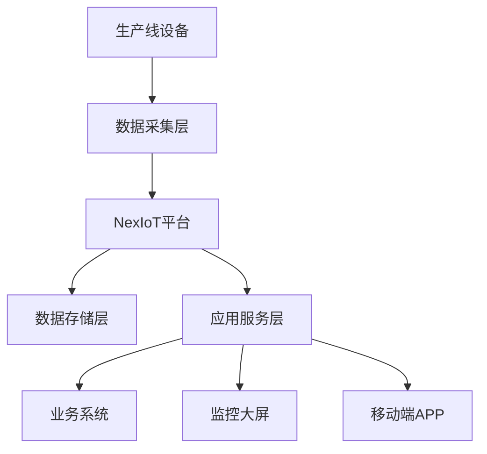

# 某制造企业物联网平台部署案例

## 🏭 项目背景

### 企业概况
- **企业名称**：某大型制造企业（应客户要求匿名）
- **行业领域**：汽车零部件制造
- **企业规模**：员工5000+，年产值50亿+
- **设备数量**：生产线设备2000+台

### 业务挑战
- **设备孤岛**：各生产线设备独立运行，缺乏统一管理
- **数据分散**：设备数据分散存储，无法形成有效分析
- **维护困难**：设备故障响应慢，维护成本高
- **效率低下**：缺乏实时监控，生产效率有待提升

## 🎯 解决方案

### 技术架构

### 核心功能模块

#### 1. 设备接入管理
- **协议支持**：TCP、Modbus、OPC-UA
- **设备类型**：PLC、传感器、仪表、机器人
- **接入方式**：直连、网关、边缘计算节点
- **设备数量**：2000+台设备同时在线

#### 2. 数据采集与存储
- **采集频率**：毫秒级数据采集
- **数据量**：日处理数据量100GB+
- **存储方案**：MySQL + InfluxDB + Redis
- **数据保留**：历史数据保留3年

#### 3. 实时监控与告警
- **监控指标**：设备状态、生产参数、质量指标
- **告警机制**：多级告警，支持短信、邮件、钉钉
- **响应时间**：故障告警响应时间<30秒
- **告警准确率**：误报率<5%

#### 4. 数据分析与可视化
- **实时大屏**：生产状态实时展示
- **历史分析**：设备运行趋势分析
- **预测维护**：基于AI的设备故障预测
- **报表系统**：自动化生产报表生成
