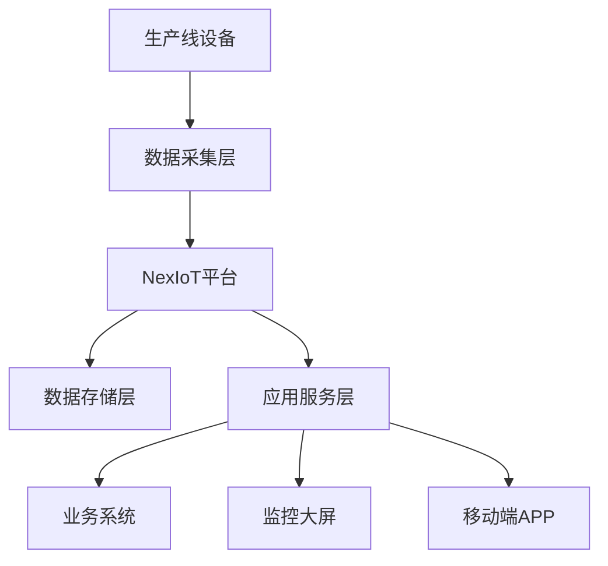

# 某制造企业物联网平台部署案例

## 🏭 项目背景

### 企业概况
- **企业名称**：某大型制造企业（应客户要求匿名）
- **行业领域**：汽车零部件制造
- **企业规模**：员工5000+，年产值50亿+
- **设备数量**：生产线设备2000+台

### 业务挑战
- **设备孤岛**：各生产线设备独立运行，缺乏统一管理
- **数据分散**：设备数据分散存储，无法形成有效分析
- **维护困难**：设备故障响应慢，维护成本高
- **效率低下**：缺乏实时监控，生产效率有待提升

## 🎯 解决方案

### 技术架构



### 核心功能模块

#### 1. 设备接入管理
- **协议支持**：TCP、Modbus、OPC-UA
- **设备类型**：PLC、传感器、仪表、机器人
- **接入方式**：直连、网关、边缘计算节点
- **设备数量**：2000+台设备同时在线

#### 2. 数据采集与存储
- **采集频率**：毫秒级数据采集
- **数据量**：日处理数据量100GB+
- **存储方案**：MySQL + InfluxDB + Redis
- **数据保留**：历史数据保留3年

#### 3. 实时监控与告警
- **监控指标**：设备状态、生产参数、质量指标
- **告警机制**：多级告警，支持短信、邮件、钉钉
- **响应时间**：故障告警响应时间<30秒
- **告警准确率**：误报率<5%

#### 4. 数据分析与可视化
- **实时大屏**：生产状态实时展示
- **历史分析**：设备运行趋势分析
- **预测维护**：基于AI的设备故障预测
- **报表系统**：自动化生产报表生成

## 📊 实施效果

### 业务指标提升

| 指标项目 | 实施前 | 实施后 | 提升幅度 |
|---------|--------|--------|----------|
| 设备利用率 | 75% | 92% | +17% |
| 故障响应时间 | 2小时 | 15分钟 | -87.5% |
| 维护成本 | 100% | 60% | -40% |
| 生产效率 | 100% | 125% | +25% |
| 数据准确率 | 85% | 98% | +13% |

### 技术指标表现

- **系统可用性**：99.9%
- **数据采集延迟**：<100ms
- **并发处理能力**：支持2000+设备同时在线
- **数据处理吞吐量**：10万条/秒
- **存储容量**：3年历史数据，总计10TB+

## 🛠️ 技术实现

### 部署架构

#### 生产环境配置
- **服务器配置**：8台物理服务器
- **数据库**：MySQL主从集群 + InfluxDB集群
- **缓存**：Redis集群
- **负载均衡**：Nginx + Keepalived
- **监控**：Prometheus + Grafana

#### 网络架构
- **内网部署**：核心系统部署在内网
- **安全隔离**：生产网络与办公网络物理隔离
- **VPN接入**：支持远程运维VPN接入
- **防火墙**：多层防火墙防护

### 关键配置

#### 设备接入配置
```yaml
# TCP设备配置
tcp:
  enabled: true
  port: 8080
  max_connections: 2000
  timeout: 30000
  keepalive: true

# Modbus设备配置
modbus:
  enabled: true
  devices:
    - name: "生产线1-PLC"
      type: "tcp"
      host: "192.168.1.100"
      port: 502
      slave_id: 1
      registers:
        - address: 40001
          type: "holding"
          data_type: "float32"
          name: "温度"
```

#### 数据存储配置
```yaml
# 数据库配置
database:
  mysql:
    host: "mysql-cluster"
    port: 3306
    database: "nexiot"
    username: "nexiot"
    password: "***"
  
  influxdb:
    host: "influxdb-cluster"
    port: 8086
    database: "iot_data"
    retention_policy: "3y"
```

## 💡 经验总结

### 成功要素

#### 1. 充分的需求调研
- **业务需求**：深入了解业务流程和痛点
- **技术需求**：明确技术指标和性能要求
- **集成需求**：梳理现有系统集成要求
- **扩展需求**：考虑未来业务扩展需求

#### 2. 分阶段实施
- **第一阶段**：核心设备接入和基础监控
- **第二阶段**：数据分析和告警系统
- **第三阶段**：高级功能和优化
- **第四阶段**：AI预测和智能运维

#### 3. 团队协作
- **技术团队**：专业的物联网技术团队
- **业务团队**：熟悉业务流程的业务专家
- **运维团队**：有经验的系统运维团队
- **管理团队**：项目管理和协调支持

### 挑战与解决

#### 1. 数据量大
**挑战**：日处理数据量100GB+
**解决方案**：
- 采用时序数据库InfluxDB
- 实施数据分层存储策略
- 优化数据压缩算法
- 建立数据生命周期管理

#### 2. 设备协议复杂
**挑战**：设备协议多样，标准不统一
**解决方案**：
- 开发通用协议适配器
- 建立协议模板库
- 提供可视化协议配置
- 支持协议热插拔

#### 3. 系统稳定性
**挑战**：7x24小时不间断运行
**解决方案**：
- 采用高可用架构设计
- 实施多级容灾备份
- 建立完善的监控体系
- 制定详细的应急预案

## 🎯 客户反馈

### 技术负责人评价
> "NexIoT平台的零代码侵入设计理念非常适合我们这种传统制造企业，不需要修改现有系统就能快速接入设备，大大降低了实施难度和风险。"

### 运维团队评价
> "平台的稳定性非常好，运行半年多没有出现重大故障，监控和告警功能也很完善，大大提升了我们的运维效率。"

### 业务部门评价
> "通过实时监控和数据分析，我们能够及时发现生产异常，生产效率提升了25%，设备故障响应时间从2小时缩短到15分钟。"

## 📈 后续规划

### 短期规划（6个月）
- **功能扩展**：增加更多设备类型支持
- **性能优化**：进一步提升系统性能
- **用户体验**：优化界面和操作流程
- **培训支持**：加强用户培训和技术支持

### 中期规划（1年）
- **AI集成**：集成AI预测维护功能
- **边缘计算**：部署边缘计算节点
- **移动应用**：开发移动端管理应用
- **生态建设**：建立合作伙伴生态

### 长期规划（2-3年）
- **平台化**：向行业平台方向发展
- **标准化**：推动行业标准制定
- **国际化**：拓展海外市场
- **生态化**：构建完整产业生态

---

*案例更新时间：2025-01-15*
